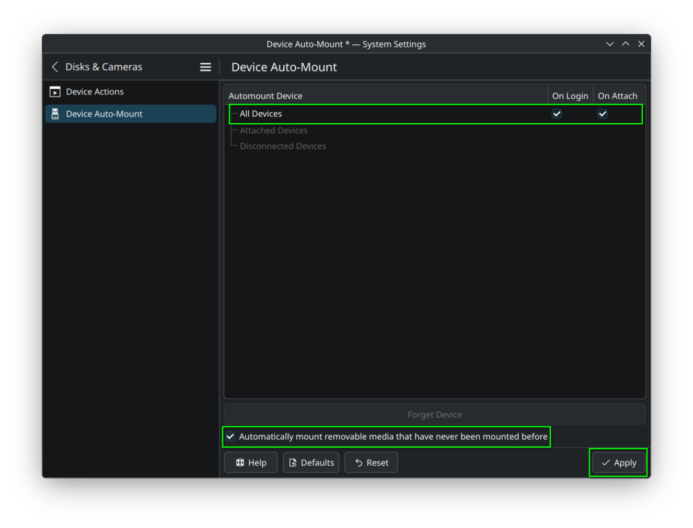

# Automouting Disks/Partitions

!!! info
	For the system to access disk partitions, they must be mounted. It's normal for the disks not to be visible because your distribution doesn't mount them automatically.

!!! info
	To mount partitions using the NTFS filesystem, the `ntfs-3g` package must be installed (the script installs it automatically).

### If you are using KDE Plasma

KDE Plasma allows you to configure automount via system settings.

- Go to `System Settings > Disks & Cameras > Device Auto-Mount` and make the settings accordingly and click the `Apply` button:

### If you are using another desktop environment

If you are using another desktop environment, you can do this by editing the `/etc/fstab` file.

