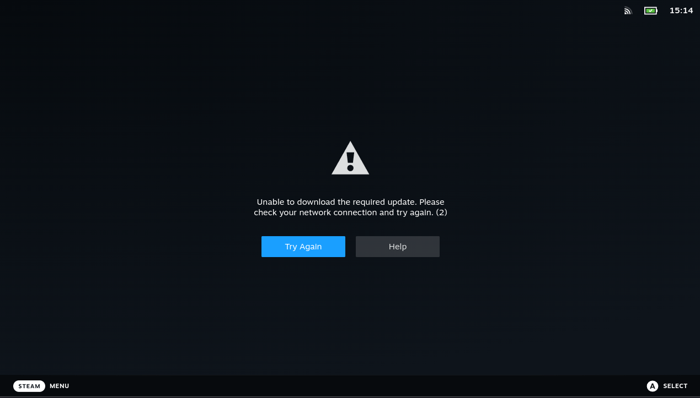
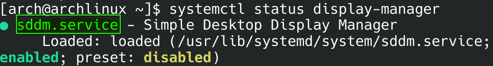
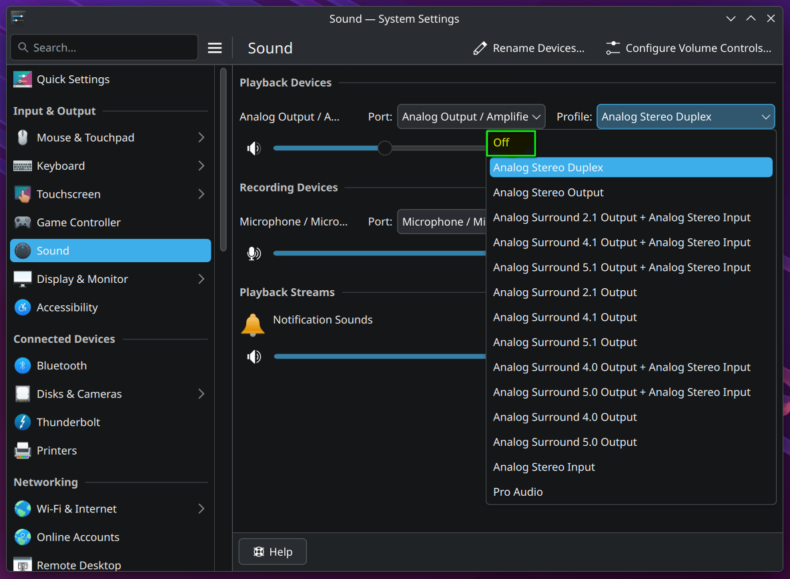
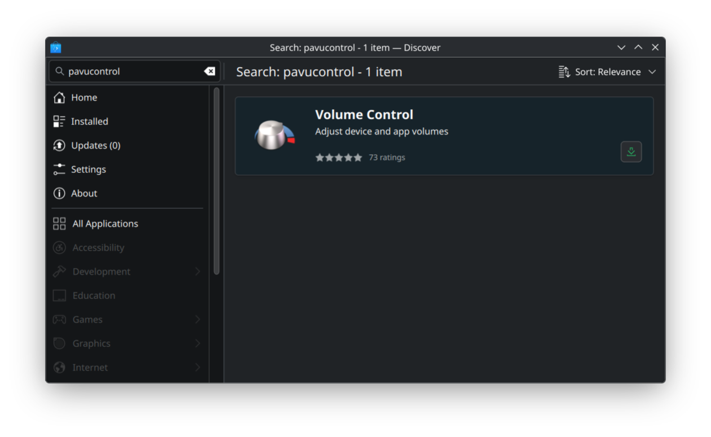
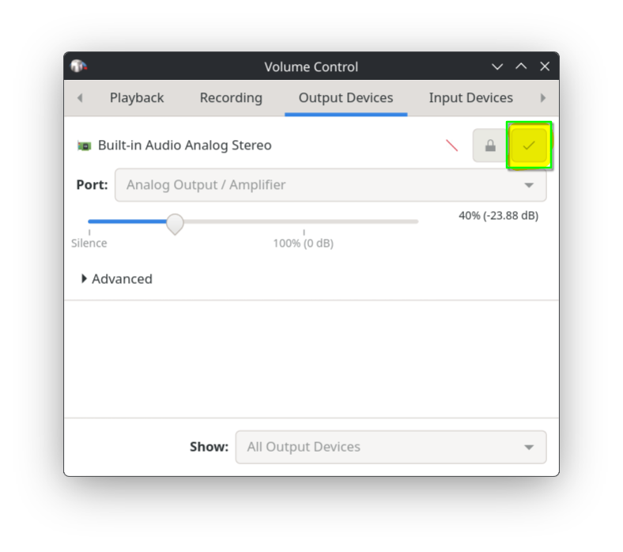

!!! info
	This section contains frequently asked questions (FAQ) and some known issues.
## When I switch to Gaming Mode it takes me back to the desktop
- The Gamescope session may fail to start for some reason.
- Alternatively, there might be an issue with the shortcut used to switch to Game Mode. Try switching manually by running `steamos-session-select gamescope`  in the terminal.
- If you can enter Game Mode by selecting the Steam Big Picture Mode session from the login screen and logging in, the issue may be with the SDDM configuration, which is located at `/etc/sddm.conf`.

## Stuck on a Black Screen, Cannot return to Desktop again
!!! info
	If you stuck on a black screen, try switching to a TTY with key combinations (ex.: `CTRL+ALT+F4`), login with your username and password, run the `steamos-session-select desktop` command, and then return to the first TTY using the `CTRL+ALT+F1` (or `CTRL+ALT+F2`) key combination. You will be back in desktop mode.
- Steam may be downloading files in the background during the initial launch; in that case, please wait a few minutes.
- The Gamescope session may fail to start for some reason, and now it shows a black screen.
- Your hardware may not be supported. If you want to remove the script, you can use the **Uninstall** option in GUI Helper.

## Steam Unable to download the required update Error

- Return to desktop mode, launch Steam as usual, and sign in to your account. When you switch back to game mode, the error screen will disappear.
!!! info
	If the “Return to Desktop” option does not appear and you cannot return to the desktop, try switching to a TTY using a key combination (e.g., `CTRL+ALT+F4`), log in with your username and password, run the `steamos-session-select desktop` command, and then return to the first TTY using the `CTRL+ALT+F1` (or `CTRL+ALT+F2`) key combination. You will be back in desktop mode.

## What is the SDDM and how can I install it?
- **SDDM** is a display manager for Linux that handles graphical login, allowing you to choose a user account and start a desktop session.
- Display managers are the login screen that appears when you start your system.
- It is usually included by default on systems with the KDE Plasma desktop.
- The script switches between desktop mode and gaming mode by editing SDDM's config file each time.
- If SDDM is not available on your system, firstly you need to know and uninstall the display manager you're currently using. 
> - You can see the current display manager with the `systemctl status display-manager` command.
> - In the `Loaded:` section you will see the current display manager `(like gdm.service or lightdm.service)`
> 	
> - For example, if you have GDM on your system, to disable it: `sudo systemctl disable gdm.service`
> - Afterwards, you can install and enable the SDDM package with the commands below.

If SDDM is not installed on your system, you can install it with the following command:
```bash
# If you are using another display manager, you must disable it first (explained above).
sudo pacman -S sddm          # installs SDDM package
sudo systemctl enable sddm.service   # enables SDDM service
```

## Stuck on a Black Screen, Cannot return to Desktop again
!!! info
	If you stuck on a black screen, try switching to a TTY with key combinations (ex.: `CTRL+ALT+F4`), login with your username and password, run the `steamos-session-select desktop` command, and then return to the first TTY using the `CTRL+ALT+F1` (or `CTRL+ALT+F2`) key combination. You will be back in desktop mode.
- The Gamescope session may fail to start for some reason, and now it shows a black screen.
- Your hardware may not be supported. If you want to remove the script, you can use the **Uninstall** option in GUI Helper.

## External Drives Not Showing Up in Steam
!!! info
	For the system to access disk partitions, they must be mounted. It's normal for the disks not to be visible because your distribution doesn't mount them automatically.
**For more information, check [auto mounting](automount.md) page.**

## Steam Always Chooses Non-Default Audio Output Device (No Audio)
With the methods mentioned below, you can make the audio output device you want as the default, or disable the audio output devices you do not want.

#### If you are using KDE Plasma
- Go to `System Settings > Sound` disable the **broken** playback device by selecting `Off`:


#### If you are using another desktop environment
- Install Volume Control `(or pavucontrol)` software.

From Arch Linux repositories:
```bash
sudo pacman -S pavucontrol
```
From Flathub:
```bash
flatpak install flathub org.pulseaudio.pavucontrol
```


- In `Output Devices` tab, find your audio output device and make it default:


## Black Screen in Multiple Display Setups
!!! info
	Since the Gamescope is designed to work only in single-display mode, it may not work in multi-display setups.
